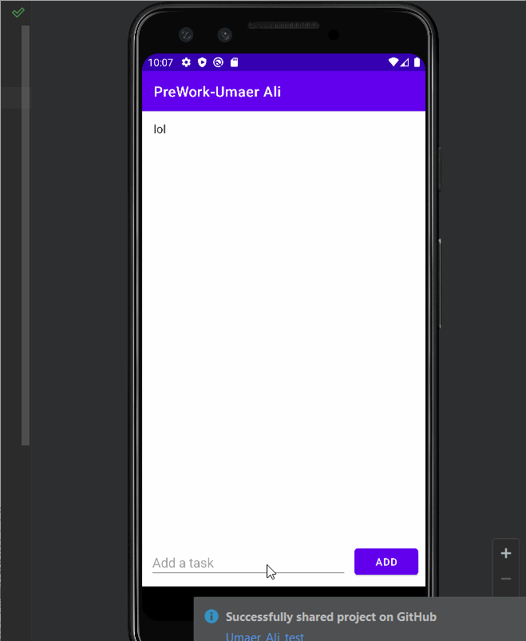

# uaa23_CS388_HW1
# SimpleToDoKotlinVersion

# Project 1 - SimpleToDo

Name of your app is an android app that allows building a todo list and basic todo items management functionality including adding new items, editing and deleting an existing item.

Submitted by:

Time spent: X hours spent in total

## User Stories

The following required functionality is completed:

* [] User can view a list of todo items
* [] User can successfully add and remove items from the todo list
* [] User's list of items persisted upon modification and and retrieved properly on app restart

The following optional features are implemented:

* [ ] User can tap a todo item in the list and bring up an edit screen for the todo item and then have any changes to the text reflected in the todo list

The following additional features are implemented:

* [] List anything else that you can get done to improve the app functionality!
* [] Changing the background color
* [] changing the style of the icon
* [] styling the ActionBar
* [] styling notification bar
* [] adding icon for the app

## Video Walkthrough

Here's a walkthrough of implemented user stories:

GIF created with [LiceCap](http://www.cockos.com/licecap/).

## Notes

Describe any challenges encountered while building the app.

## License

    Copyright [2022] [name of copyright owner]
